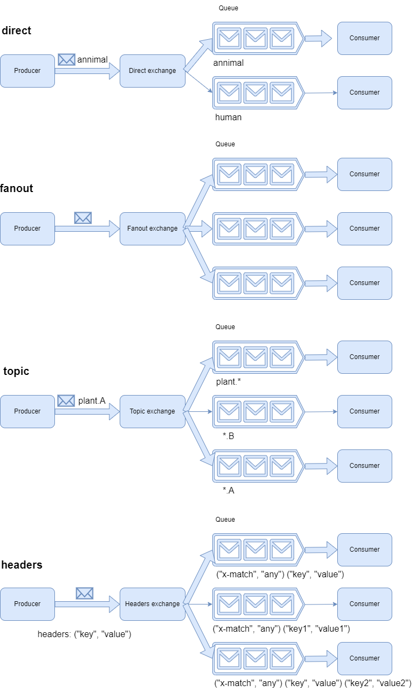

AMQP: Advanced Message Queuing Protocol
========================

# Core concepts

**Broker or message broker**: a software which receives messages from one application or service, and delivers them to
another application, service, or broker.

**Virtual host**: a vhost is a group of resources, which exists within the broker. The resources include users, exchanges
queues and so on. Users can have different access privileges to different vhosts.

**Connection**: a physical network (TCP) between the application (producer/consumer) and broker.

**Channel**: a virtual connection insides a connection. The messages are published and consumed over a channel which reuses
a connection. One Connection can contain many channels.

**Exchange**: the exchange can apply routing rules for messages, making sure that messages are reaching their final destination.
Routing rules include *direct* (point to point), *topic* (publish-subscribe), *fanout* (multicast), and *header exchanges*.

**Queue**: a sequence of messages.

**Binding**: a virtual link between an exchange and a queue. It enables messages flow from an exchange to a queue.

## Exchange

There are 4 different kinds/types of exchanges.

1. direct: routing key in messages must be matched with the queue's routing key.
2. fanout: messages will be routed to all queues bound to the fanout exchange.
3. topic: the wildcards must be matched.
4. headers: routing by using the message header properties.

The diagram below illustrates the different exchange types of how the messages are routed.

Each time a queue is created, it gets automatically bound to the default exchange with its queue name as the routing key.
The default exchange is a direct and durable exchange named "" (an empty string) that is automatically created by RabbitMQ
for each virtual host.

### Fanout exchange

Fanout exchange takes all messages that are coming in and delivers them to all queues that are bound to it. 

### Topic exchange

Unlike the direct exchange that routes messages to one queue maximum, the topic exchange can route messages to multiple
queues.

### Headers exchange

The headers exchange allows the routing of messages based on their headers, which are custom key-value pairs stored in the
message properties.

## Queue

RabbitMQ can deal with hundreds of queues and bindings without a problem. A queue can have multiple consumers, unless 
the exclusive tag is used. 

## Routing

A routing strategy determines which queue (or queues) the message will be routed to. The routing strategy bases its decision
on a routing key (a free form string) and potentially on message meta-information. You can think the routing key as an address
that the exchange uses to route the messages.

If no queue is bound to an exchange, or if the routing strategy can't find a matching destination queue, the message that
was published to the exchange will be discarded silently.

# Message structure

# Traffic cost

Establishing a connection is costly. The handshake process for an AMQP connection requires at least seven TCP packets. Each
cost of actions is as follows.

| Action                 | Cost                                    |
|:-----------------------|:----------------------------------------|
| establish a connection | 7 TCP packets                           |
| create a channel       | 2 TCP packets                           |
| Publish a message      | 1 TCP packet (more for larger messages) |
| close a channel        | 2 TCP packets                           |
| close a connection     | 2 TCP packets                           |

